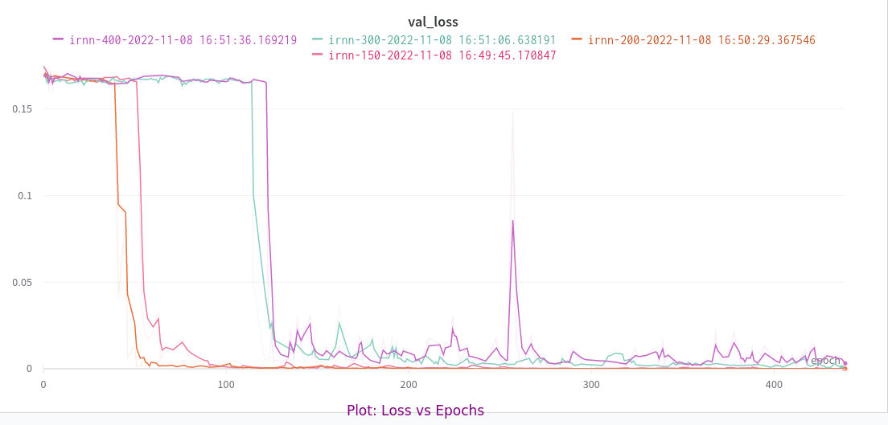
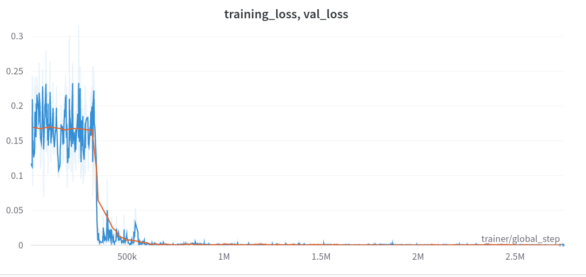

# A Simple Way to Initialize Recurrent Networks of ReLU

---

## Table of contents

---

- [Description](#description)
  - [Result](#result)
  - [Observations](#observations)
- [Installation](#installation)
- [Run](#run)

## Description

---

The goal of the project is to compute the sum of two real numbers as described in this [paper](https://arxiv.org/pdf/1504.00941.pdf).
The following things have been implemented for this -

- A dataset generator that can generate samples where at each timestamp two features are present; one is a real number, another is a mask indicator.
- For the model part, the Pytorch implementation of RNN has been patched.
- The model uses ReLU as the activation function and an identity matrix to initialize the recurrent weight matrix.

The default parameters provided in the paper are -

- Learning Rate (lr) - 0.01
- Gradient Clipping Threshold (gc) - [1, 10, 100]
- Optimizer - SGD
- Training dataset size 100_000, testing dataset size 10_000
- Minibatch size - 16
- Total Epoch - 440
- Hidden states in RNN - 100 units
- Hidden layers - 1

During the experimentation some problems arised -

- With the recommended setting, the model faced `exploding gradient` issue, and the training had to restart frequently
- SGD was taking a long time to converge

To tackle the issue, the following steps were taken

- The identity matrix used in the initialization was scaled by a factor of `0.01`
- A set of `gc` and `lr` was selected (`1` and `1e-4` respectively) for all the models
- Adam was used instead of SGD

All of these techniques resolved the exploding gradient problem and reduced the number of necessary epochs by a factor of 3. There was no need for additional normalization or regularization.

Note: The notbook in the root directory contains the pipeline for the experiment. Training and
validation information were tracked with `Weights&Biases`.

### Result

This plot shows the validation losses from each model (models with different sequence lengths)

It's the `loss vs step` plot for the `irnn-150` model. Similar results were observed across all the experiments. None of these models showed any overfitting.

`WandB` experiment details can be found [here](https://wandb.ai/mdmmn378/othoz?workspace=user-mdmmn378).

### Observations

- All the models converged towards zero eventually.
- The converging delay is directly correlated with the lenght of the sequences.
- One exception was observed with the Adam optimizer. The `irnn-200` model converged slightly faster than `irnn-150` model. The same result was obtained after the experiment was run twice more.

## Installation

---

- Python version 3.9.5
- Create a virtual environment

  - `python -m venv venv`
  - `source venv/bin/activate`

- Install requirements with `pip install -r requirements.txt`
- Install `rnn` python package with `pip install .`

## Run

---

With Docker

- `docker build -t othoz .`
- `docker run --rm -p 8888:8888 othoz`

With local Python

- `jupyter lab`
- Test with `pytest -vs`
